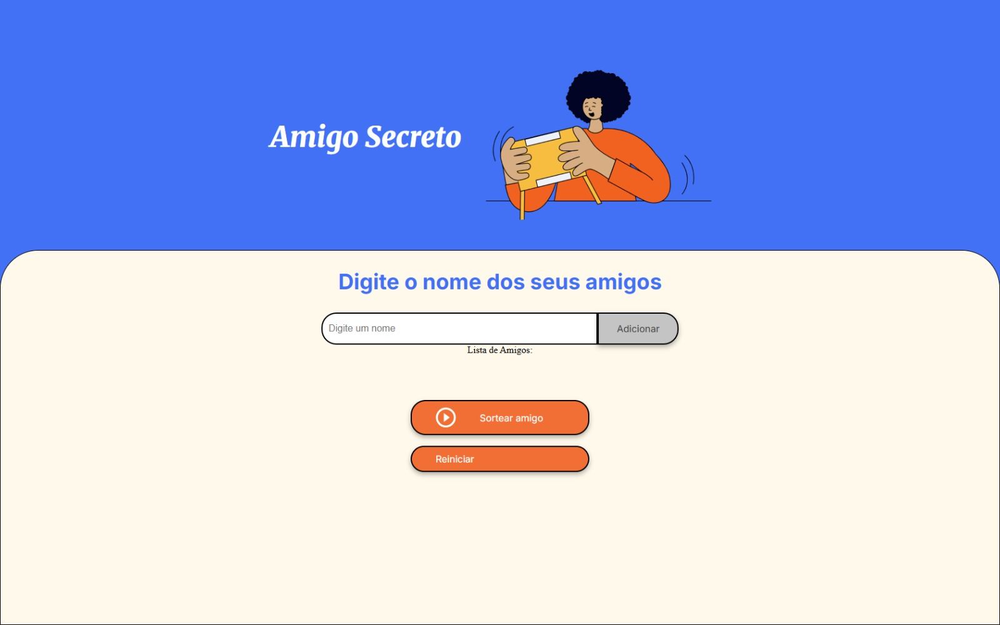
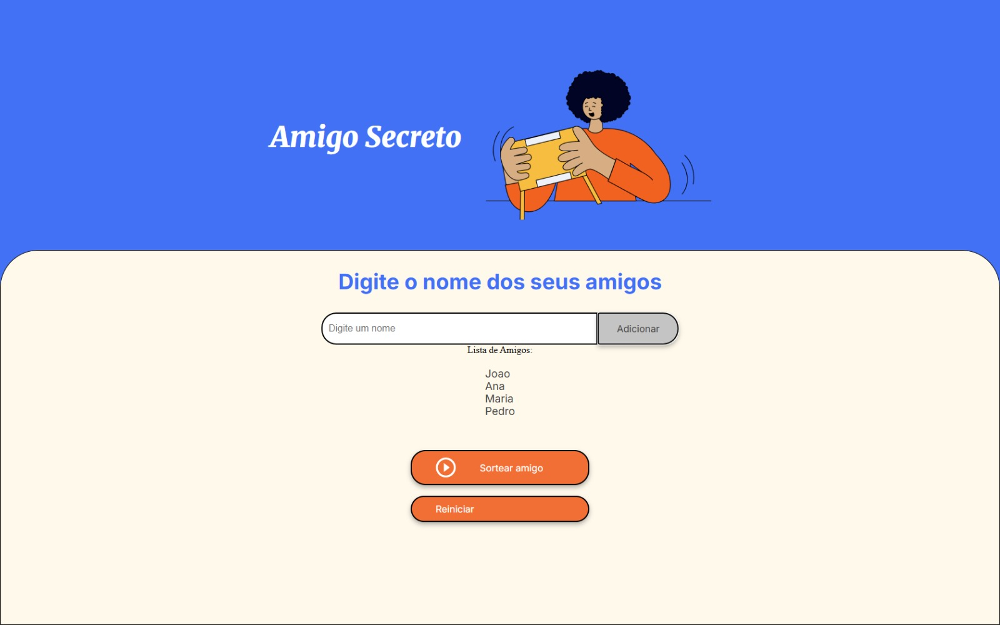
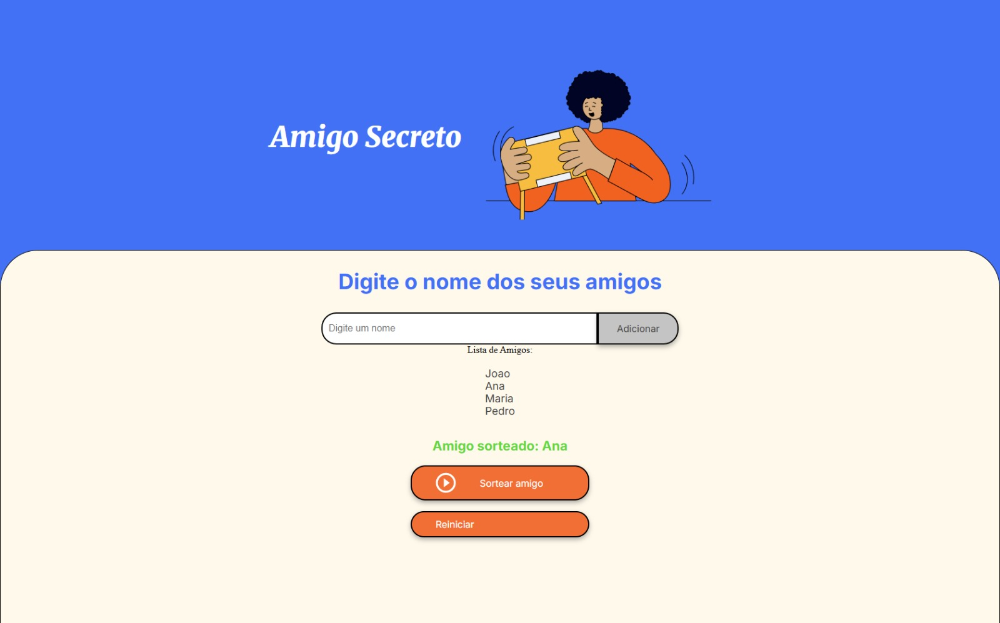

# Secret Santa

This is a simple "Secret Santa" project that allows you to add friends' names, list the added friends, and draw a Secret Santa. The project is built using HTML, CSS, and JavaScript.

## Features

- **Add Friend**: Allows you to add a friend's name to the list.
- **List Friends**: Displays the list of added friends.
- **Draw Secret Santa**: Draws a Secret Santa from the added names.
- **Reset**: Resets the friends list and the draw result.

### Home Screen

### Adding Friends

### Secret Santa Draw

## How to Use

1. **Add Friend**: Enter a friend's name in the input field and click the "Add" button.
2. **List Friends**: The added friends will be displayed in the list below the input field.
3. **Draw Secret Santa**: Click the "Draw Secret Santa" button to make the draw. The name of the drawn friend will be displayed below the list of friends.
4. **Reset**: Click the "Reset" button to clear the friends list and the draw result.

## Project Structure

- `index.html`: The HTML structure of the app.
- `style.css`: The CSS styles for the app.
- `app.js`: The JavaScript logic for adding, listing, drawing, and resetting friends.
- `assets`: Folder containing images and other resources.

## Running the Project

To run the project, simply open the `index.html` file in a web browser.

## Contributing

Feel free to contribute improvements to this project. To do so, fork the repository, create a branch for your changes, and submit a pull request.
